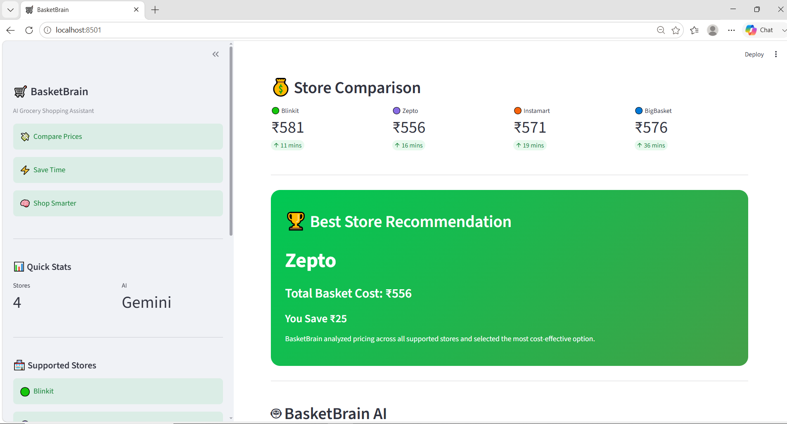
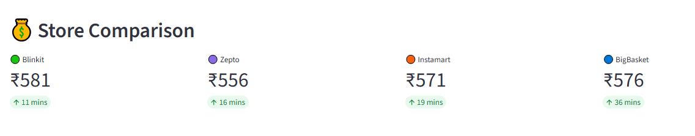
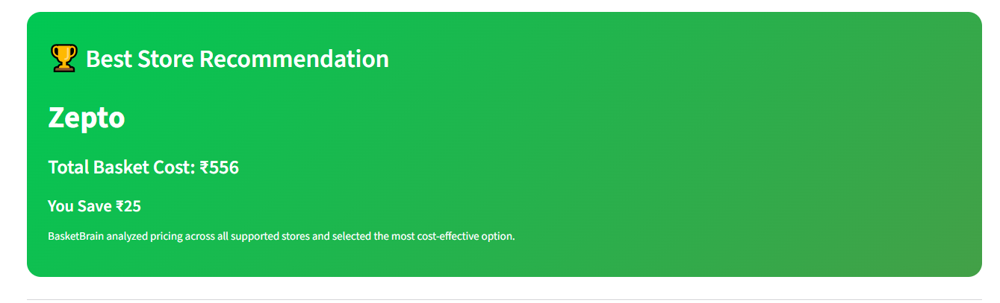
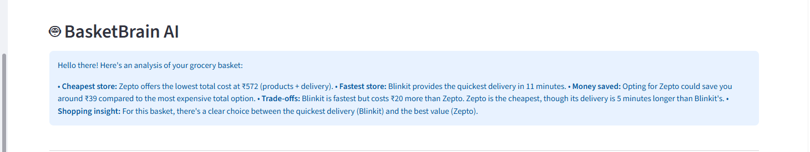
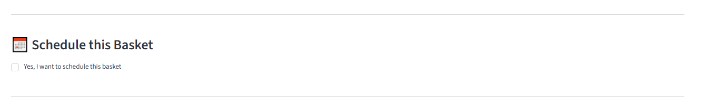
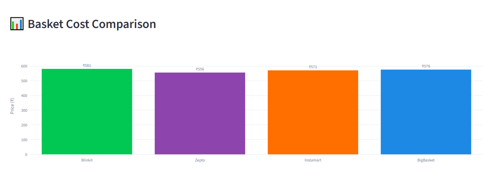

# 🛒 BasketBrain AI

> An AI-powered grocery comparison assistant built for the **Google GenAI Hackathon 2026**.

BasketBrain helps users compare grocery prices across multiple quick-commerce platforms and recommends the best shopping option using **Google Gemini AI**.

Users often:

- Pay more than necessary
- Don't know which platform is cheapest
- Ignore delivery time differences
- Have no intelligent shopping guidance

BasketBrain solves this by comparing grocery prices across multiple quick-commerce platforms, recommending the best platform, and generating AI-powered shopping insights.

---

## ✨ Features

- 🛍 Compare grocery prices
- 💰 Calculate total basket cost
- 🚚 Compare estimated delivery time
- 🤖 AI-powered shopping recommendation (Gemini)
- 📊 Interactive price comparison chart
- ⚡ Clean Streamlit interface
- ✅ Smart reminder concept for future price re-analysis

---

# 🤖 How BasketBrain Works

1. Enter your grocery list.
2. BasketBrain searches the available dataset.
3. Prices are compared across all supported stores.
4. Delivery times are analyzed.
5. The cheapest store is selected.
6. Gemini generates personalized shopping insights.
7. Users can optionally schedule their basket for future purchases.

## 📸 Screenshots

### Home Screen


### Store Comparison


### AI Recommendation


### AI Analysis



### Smart Scheduler


### Basket Cost Comparison


```
screenshots/
```

---

## 🛠 Tech Stack

- Python
- Streamlit
- Pandas
- Google Gemini API
- Git
- GitHub

---

# 📂 Project Structure

```
BasketBrain/
│
├── data/
│   └── grocery_prices.csv
│
├── main.py
├── optimizer.py
├── gemini_helper.py
├── requirements.txt
├── README.md
└── screenshots/

```

# 🚀 Future Scope

- OCR bill scanning
- Real-time grocery APIs
- Live price tracking
- Smart notifications
- Cart history
- Personalized recommendations
- Shopping analytics dashboard

---

## 🚀 Installation

Clone the repository

```bash
git clone https://github.com/ananya-jais/BasketBrain.git
```

Move inside the folder

```bash
cd BasketBrain
```

Create a virtual environment

```bash
python -m venv venv
```

Activate it

### Windows

```bash
venv\Scripts\activate
```

Install dependencies

```bash
pip install -r requirements.txt
```

Create a `.env` file

```
GEMINI_API_KEY=YOUR_API_KEY
```

Run the application

```bash
streamlit run main.py
```

---

## 🤖 Gemini AI

BasketBrain uses **Google Gemini 2.5 Flash** to generate:

- Shopping insights
- Best store recommendation
- Savings tips
- Delivery comparison
- Overall basket analysis

---

## 👩‍💻 Author

**Ananya Jaiswal**

B.Sc. (Hons.) Computer Science  
University of Delhi

GitHub:
https://github.com/ananya-jais

---

## 📜 License

This project is created for learning and hackathon purposes.
